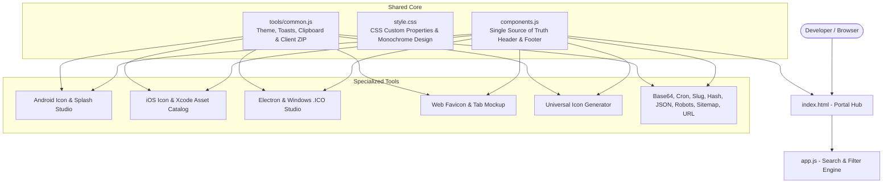

# DevTools

<div align="center">


### Minimalist, Local-First Developer Utilities Suite

A curated collection of essential, distraction-free developer tools built with vanilla web technologies. Designed for speed, aesthetics, and privacy — **all computations run 100% client-side in your browser.**

[](LICENSE)
[](tools/common.js)
[](#privacy--local-first)
[](CONTRIBUTING.md)

[**Explore DevTools**](https://ichshakib.github.io/devtools/) • [**Report Bug**](https://github.com/ichshakib/devtools/issues) • [**Request Tool**](https://github.com/ichshakib/devtools/issues)

</div>

---

## Table of Contents

- [Philosophy & Core Principles](#philosophy--core-principles)
- [Tools Directory](#tools-directory)
  - [App Icon & Asset Generators](#app-icon--asset-generators)
  - [Generators & Utilities](#generators--utilities)
  - [Encoders & Converters](#encoders--converters)
  - [SEO & Web](#seo--web)
  - [Formatters & Validators](#formatters--validators)
- [Architecture & Tech Stack](#architecture--tech-stack)
- [Quick Start & Local Development](#quick-start--local-development)
- [Project Structure](#project-structure)
- [Contributing](#contributing)
- [Code of Conduct](#code-of-conduct)
- [License](#license)

---

## Philosophy & Core Principles

DevTools was engineered to solve the frustration of ad-heavy, slow, tracking-laden online developer utilities.

1. **100% Client-Side & Local-First**: No data, master images, code snippets, or keys ever leave your machine. No tracking, telemetry, or server-side computation.
2. **Zero Runtime Dependencies**: Built entirely with Vanilla JavaScript, HTML5 Canvas, Web Crypto API, and pure CSS. No bulky node_modules or heavy UI frameworks required to run.
3. **Instant & Distraction-Free**: Minimalist, monochrome aesthetics with seamless dark/light theme switching, responsive design, and zero flash of unstyled content (FOUC).
4. **Single-Source Component Architecture**: Shared header, footer, theme persistence, and global search keybindings (`Ctrl+K` or `/`) are dynamically managed via `components.js`.

---

## Tools Directory

### App Icon & Asset Generators

| Tool | Description | File Formats & Presets |
|---|---|---|
| 🤖 **[Android Icon & Splash Generator](tools/android-icon-generator.html)** | Complete Android asset package generator with custom background colors, adaptive safe margin sliders, and an interactive **Splash Screen Studio** with live phone mockup preview. | `mipmap` (mdpi–xxxhdpi), `ic_launcher_round.png`, `playstore-512.png`, adaptive layers (foreground/background), splash screens (1080x2400, 1080x1920, 1920x1080, 1536x2048, Android 12+ 288x288), `styles.xml` |
| 🍏 **[iOS App Icon Generator](tools/ios-icon-generator.html)** | Apple App Store-compliant iOS icon generator with solid background fill controls (App Store rejects alpha channels) and Xcode asset catalog export. | App Store 1024x1024, iPhone App (180, 120), iPad Pro (167), iPad App (152, 76), Spotlight, Settings, Notifications, and `Contents.json` |
| 💻 **[Electron & Desktop Icon Generator](tools/electron-icon-generator.html)** | Multi-resolution Windows `.ico` binary generator, macOS Retina PNGs, and Linux desktop icons with copyable `BrowserWindow` and `electron-builder` configuration snippets. | Multi-res Windows `.ico` (16–256px), macOS Retina 1024x1024, macOS 512x512, Linux standard (16–512px) |
| 🌐 **[Web Favicon & Manifest Generator](tools/favicon-generator.html)** | Multi-size favicon generator featuring a live interactive browser tab mockup, modern PNG favicons, dynamic `site.webmanifest` export, and copyable HTML `<head>` tags. | Multi-size `favicon.ico` (16, 32, 48px), `apple-touch-icon.png` (180x180), Android Chrome (192, 512px), `favicon-32.png`, `favicon-16.png`, `site.webmanifest` |
| 📦 **[Universal App Icon Generator](tools/app-icon-generator.html)** | All-in-one generator with target platform checkboxes to export Desktop, iOS, Android, and Web icons simultaneously. | Combined multi-platform export + Windows `.ico` |

> [!TIP]
> **Client-Side ZIP Packaging**: All icon generators include a **Download ZIP** button powered by an internal zero-dependency PKZIP engine. You can download the entire structured asset package in a single `.zip` file without annoying browser multi-file permission prompts, or download icons individually one-by-one.

### Generators & Utilities

| Tool | Description |
|---|---|
| 🔗 **[URL Slug Generator](tools/slug-generator.html)** | Convert headlines, titles, and sentences into clean, URL-friendly, SEO-optimized slugs with customizable delimiters (`-`, `_`, `.`), lowercase filters, and special character sanitization. |
| ⏱️ **[Cron Job Generator](tools/cron-generator.html)** | Build, inspect, and decipher standard 5-part crontab expressions with natural language descriptions, preset schedules, and live execution previews. |

### Encoders & Converters

| Tool | Description |
|---|---|
| 🔤 **[Base64 Encoder / Decoder](tools/base64.html)** | Encode and decode plain text, binary files, images, ASCII strings, and Data URIs to and from Base64 format with instant live preview and file drop. |
| 🔒 **[Hash & Checksum Generator](tools/hash-generator.html)** | Compute cryptographic hashes (MD5, SHA-1, SHA-256, SHA-512) directly in your browser using the native browser Web Crypto API. |
| 🌐 **[URL Percent Encoder / Decoder](tools/url-encoder.html)** | Safely encode and decode query parameters, full URLs, and reserved URI characters according to RFC 3986. |

### SEO & Web

| Tool | Description |
|---|---|
| 🤖 **[Robots.txt Generator](tools/robots-txt.html)** | Configure search crawler access rules, user-agent directives, disallow/allow paths, crawl-delay, and XML sitemap references with one-click copy and download. |
| 🗺️ **[Sitemap.xml Generator](tools/sitemap-generator.html)** | Build standard XML sitemaps with URL entries, change frequencies, priority scores, and last-modified timestamps formatted for search engines. |

### Formatters & Validators

| Tool | Description |
|---|---|
| 📋 **[JSON Formatter & Validator](tools/json-formatter.html)** | Beautify, format, validate, minify, and inspect JSON payloads with real-time syntax error detection, custom indentation (2 spaces, 4 spaces, tabs), and statistics. |

---

## Architecture & Tech Stack



- **Core**: Vanilla HTML5, JavaScript (ES6+), Canvas 2D Context.
- **Styling**: Vanilla CSS utilizing CSS Custom Properties for theme tokens (`--bg-primary`, `--border-color`, `--text-primary`), system font fallbacks, and high-DPI display optimizations.
- **Binary Generation**:
  - Windows `.ico` binary generator constructed from scratch directly from canvas pixel buffers.
  - Zero-dependency client-side PKZIP 2.0 archive compiler with CRC32 checksums.
- **Cryptography**: Native W3C Web Cryptography API (`crypto.subtle`).

---

## Quick Start & Local Development

DevTools requires no installation, build step, or bundling. You can run it with any local static HTTP server:

### 1. Clone the Repository
```bash
git clone https://github.com/ichshakib/devtools.git
cd devtools
```

### 2. Start a Local Server

Using Python:
```bash
python -m http.server 3000
```

Using Node.js (`npx`):
```bash
npx serve .
```

Using PHP:
```bash
php -S localhost:3000
```

### 3. Open in Browser
Visit `http://localhost:3000` to access the full portal and all utilities.

---

## Project Structure

```
devtools/
├── index.html                   # Main portal landing page with live search & filters
├── app.js                       # Portal logic (search indexing, tag filtering, tool metadata)
├── components.js                # Shared header, footer, theme engine, and keybindings
├── style.css                    # Design system tokens and shared utility styles
├── logo.svg                     # DevTools branding vector
├── LICENSE                      # MIT License
├── README.md                    # Project documentation
├── CONTRIBUTING.md              # Contributor guide & template for adding tools
├── CODE_OF_CONDUCT.md           # Community guidelines (Contributor Covenant)
└── tools/                       # Individual standalone tools
    ├── common.js                # Shared utilities (toast, clipboard, zip builder)
    ├── android-icon-generator.html
    ├── ios-icon-generator.html
    ├── electron-icon-generator.html
    ├── favicon-generator.html
    ├── app-icon-generator.html
    ├── base64.html
    ├── cron-generator.html
    ├── hash-generator.html
    ├── json-formatter.html
    ├── robots-txt.html
    ├── sitemap-generator.html
    ├── slug-generator.html
    └── url-encoder.html
```

---

## Keyboard Shortcuts

- <kbd>Ctrl</kbd> + <kbd>K</kbd> or <kbd>/</kbd> — Focus quick search input on the portal.
- <kbd>Esc</kbd> — Clear search filter or close active modals/toasts.

---

## Contributing

Contributions are welcome! Whether you are proposing a new developer utility, refining an existing generator, or fixing an issue, please read our [**Contributing Guide**](CONTRIBUTING.md) to get started.

---

## Code of Conduct

We are committed to providing a welcoming, inclusive, and harassment-free experience for everyone. Please review our [**Code of Conduct**](CODE_OF_CONDUCT.md).

---

## License

Distributed under the **MIT License**. See [LICENSE](LICENSE) for more details.

Crafted with care by **[Shakib Khan](https://github.com/ichshakib)**.